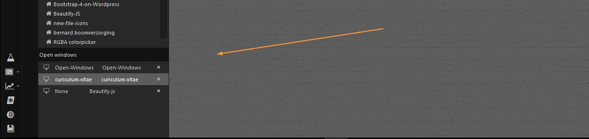
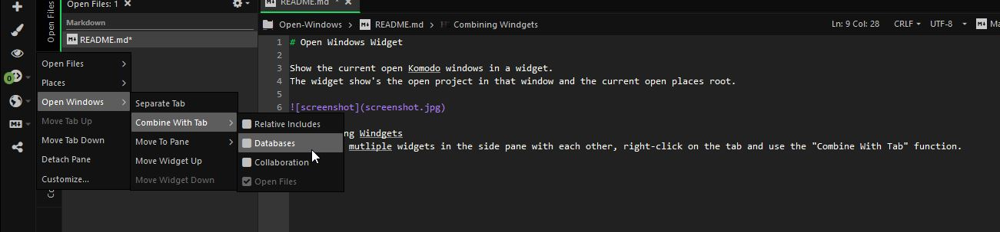

# Open Windows Widget

Show the current open Komodo windows in a widget.  
The widget show's the open project in that window and the current open places root.

## Combining Widgets
To Combine multiple widgets in the side pane with each other, right-click on the tab and use the "Combine With Tab" function.

